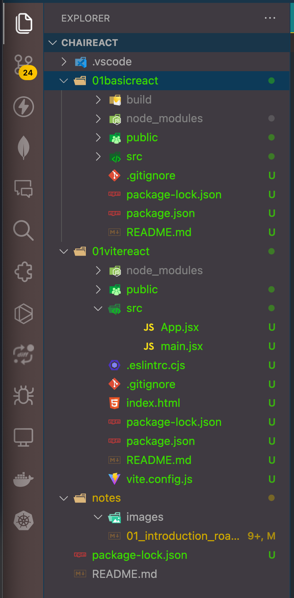

documentation: https://react.dev/

### bundler
- e.g. Vite, Parcel
- These bundlers take your project's multiple JavaScript files and their dependencies, and combine them into a single, optimized file. 
- This bundled file is then loaded by the browser, improving the performance and efficiency of your web application.

Here's a breakdown of how bundlers work:
1. **Dependency Management:** Modern web applications rely on various JavaScript libraries and frameworks. Bundlers identify these dependencies and their relationships.
2. **Code Combining:** The bundler merges all the necessary code from your project files and dependencies into a single file.
3. **Optimization:** Bundlers can perform optimizations like minification (reducing file size) and tree-shaking (removing unused code) to further enhance performance.


# creating react project

## using npx (node package executor)
	`npx create-react-app 01basicreact`
	where `create-react-app` is a utility but it is bulky

note: name can no longer contain capital letters

Always start with `package.json` to understand build and testing phases.

### run
to run the application
	`npm run start`

### build
to build the project
	`npm run build`
It will create a folder called `build` in root folder. It contains static files, javascript files.
In production, `build` folder is used and not `src` folder

## creating project using vite
[documentation link](https://vitejs.dev/guide/)

creating a project
```sh
$ npm create vite@latest
Need to install the following packages:
create-vite@5.2.2
Ok to proceed? (y) 
✔ Project name: … 01vitereact
✔ Select a framework: › React
✔ Select a variant: › JavaScript

Scaffolding project in /Users/raghavnayak/Developer/Programming/javascript/chaiReact/01vitereact...

Done. Now run:

  cd 01vitereact
  npm install
  npm run dev
```

running the project
```sh
$ cd 01vitereact
$ npm install
$ npm run dev
```

Before cleaning up the projects


after cleaning up the project
