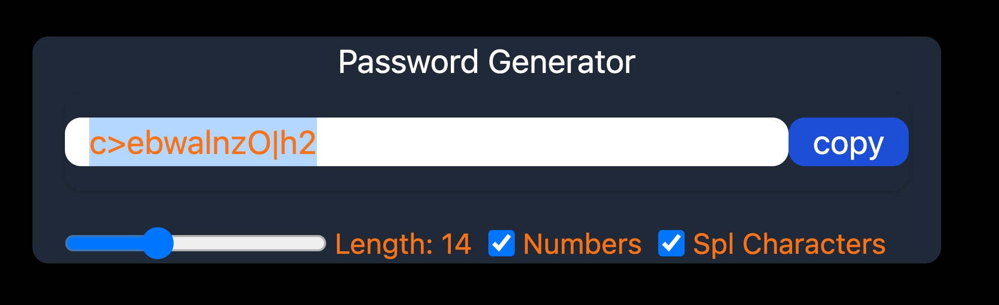

<h1> useEffect, useRef and useCallback </h1>

These **hooks** are fundamental building blocks in React functional components, enabling them to manage side effects, maintain references, and optimize performance efficiently.
#### [useEffect](https://react.dev/reference/react/useEffect)
-  a hook that allows performing side effects in functional components. 
- Side effects can include data fetching, subscriptions, or manually changing the DOM.
- It's somewhat analogous to lifecycle methods in class components, such as `componentDidMount`, `componentDidUpdate`, and `componentWillUnmount`.

Syntax:
```js
useEffect(() => {
    // Effect code
    return () => {
        // Cleanup code (optional)
    };
}, [dependency1, dependency2, ...]);
```
- The first argument is a function that contains the code to be executed as a side effect.
- The second argument is an optional array of dependencies. If provided, the effect will only run if the dependencies have changed since the last render.

#### [useRef](https://react.dev/reference/react/useRef)
- is a React Hook that lets you reference a value that’s not needed for rendering.
- is a hook that returns a mutable ref object whose `.current` property is initialized to the passed argument (initialValue). 
- The returned object will persist for the full lifetime of the component.
```js
const myRef = useRef(initialValue);
```
- `myRef.current` can be used to access and modify the current value of the ref.
- It's commonly used to persist values across renders without causing a re-render, or to access the underlying DOM node or React element.

#### [useCallback](https://react.dev/reference/react/useCallback)
- is a React Hook that lets you cache a function definition between re-renders.
- is a hook that returns a memoized callback function. 
- It's useful for optimizing performance by memoizing functions to prevent unnecessary re-renders in child components.

```js
const memoizedCallback = useCallback(
    () => {
        // Callback function
    },
    [dependency1, dependency2, ...]
);
```
- The first argument is the callback function you want to memoize.
- The second argument is an optional array of dependencies. If provided, the callback will only be re-created if any of the dependencies have changed.


<hr>

we cannot directly call the function. The state is controlled by React. 


useEffect() -> if any changes happen in any of the parameters, then update the value
useCallback() -> for memoization ; optimization purposes; without this also you can build this.

useRef() -> is used to copy the password.
with each input you can pass a reference.

As we are using core react, we can use `window`. Server side we cannot use this.

```js
import { useCallback, useEffect, useRef, useState } from 'react';


function App() {
    const [length, setLength] = useState(8);
    const [numberAllowed, setNumberAllowed] = useState(false);
    const [splCharAllowed, setSplCharAllowed] = useState(false);
    const [password, setPassword] = useState("");

    // useRef hook
    const passwordRef = useRef(null);

    const passwordGenerator = useCallback(() => {
        let allowedChars = "ABCDEFGHIJKLMNOPQRSTUVWXYZabcdefghijklmnopqrstuvwxyz"; 
        if (numberAllowed) allowedChars += "0123456789";
        if (splCharAllowed) allowedChars += "!@#$%^&*()_+-={}[]|:;<>";
        let generatedPassword = "";

        for (let i = 1; i <= length; i++) {
            let charPosition = Math.floor(Math.random() * allowedChars.length + 1);
            generatedPassword  += allowedChars.charAt(charPosition)
        }
        setPassword(generatedPassword)
    }, [length, numberAllowed, splCharAllowed, setPassword]);

    const copyPasswordToClipboard = useCallback(() => {
        passwordRef.current?.select(); // to display the selected text
        passwordRef.current?.setSelectionRange(0, password.length); // display the selected text with range
        window.navigator.clipboard.writeText(password); // copy the password to clipboard
    }, [password]);

    useEffect(() => {
        passwordGenerator();
    }, [length, numberAllowed, splCharAllowed, passwordGenerator]);

    return (
        <>
            <div className="w-full max-w-md mx-auto shadow-md rounded-lg px-4 my-6 text-orange-500 bg-gray-800">
                <h1 className="text-white text-center my-1"> Password Generator </h1>
                <div className="flex shadow rounded-lg overflow-hidden mb-4 py-3">
                    <input
                        type="text"
                        value={password}
                        className="outline-none w-full py- px-3 rounded-lg"
                        placeholder="password"
                        readOnly
                        ref={passwordRef}
                    />
                    <button
                        onClick={copyPasswordToClipboard}
                        className="outline-none bg-blue-700 text-white px-3 py-05 shrink-0 rounded-lg">
                        copy
                    </button>
                </div>
                
                <div className="flex text-sm gap-x-2">
                    <div className="flex items-center gap-x-1">
                        <input
                            type="range"
                            min={6}
                            max={30}
                            className="cursor-pointer"
                            onChange={ (event) => {setLength(event.target.value)}}
                        />
                        <label> Length: {length}</label>
                    </div>
                    <div className="flex items-center gap-x-1">
                        <input
                            type="checkbox"
                            defaultChecked={numberAllowed}
                            id="numberInput"
                            onChange={ () => {setNumberAllowed((prevVal) => !prevVal)}} /* to flip the value from true to false */
                        />
                        <label htmlFor="numberInput"> Numbers </label>  
                    </div>
                    <div className="flex items-center gap-x-1">
                        <input
                            type="checkbox"
                            defaultChecked={splCharAllowed}
                            id="splCharacterInput"
                            onChange={ () => {setSplCharAllowed((prevVal) => !prevVal)}} /* to flip the value from true to false */
                        />
                        <label htmlFor="numberInput"> Spl Characters </label>  
                    </div>  
                </div>
            </div>
        </>
    )
}

export default App
```

<br>

