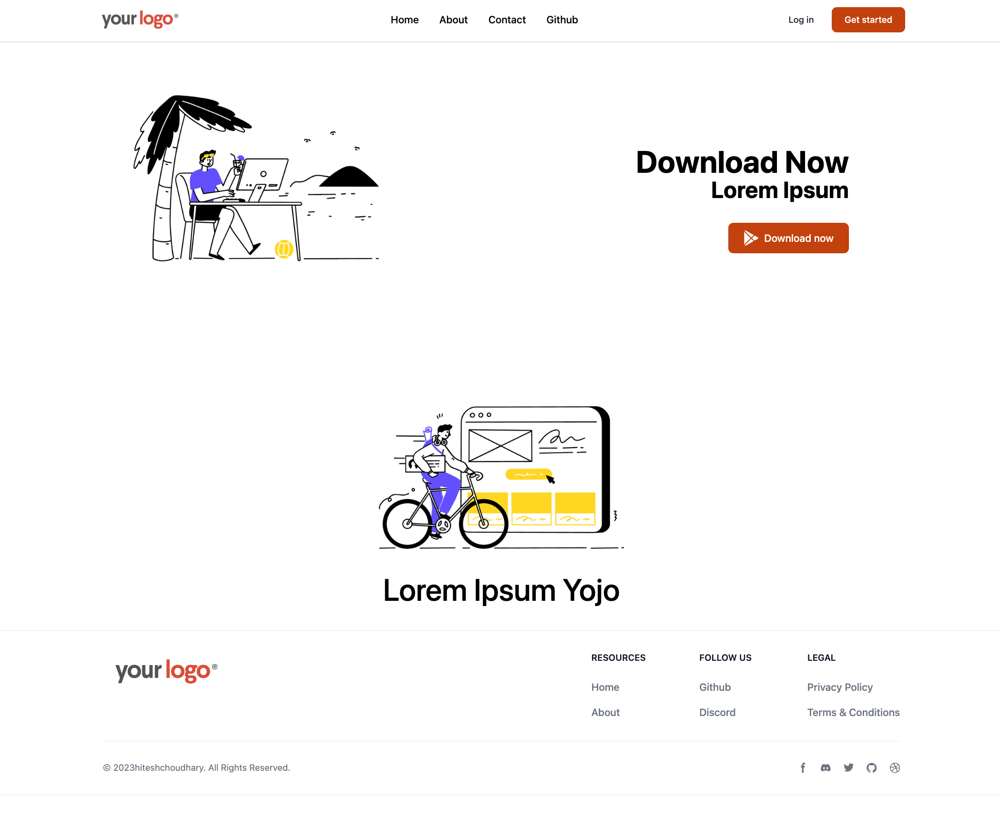
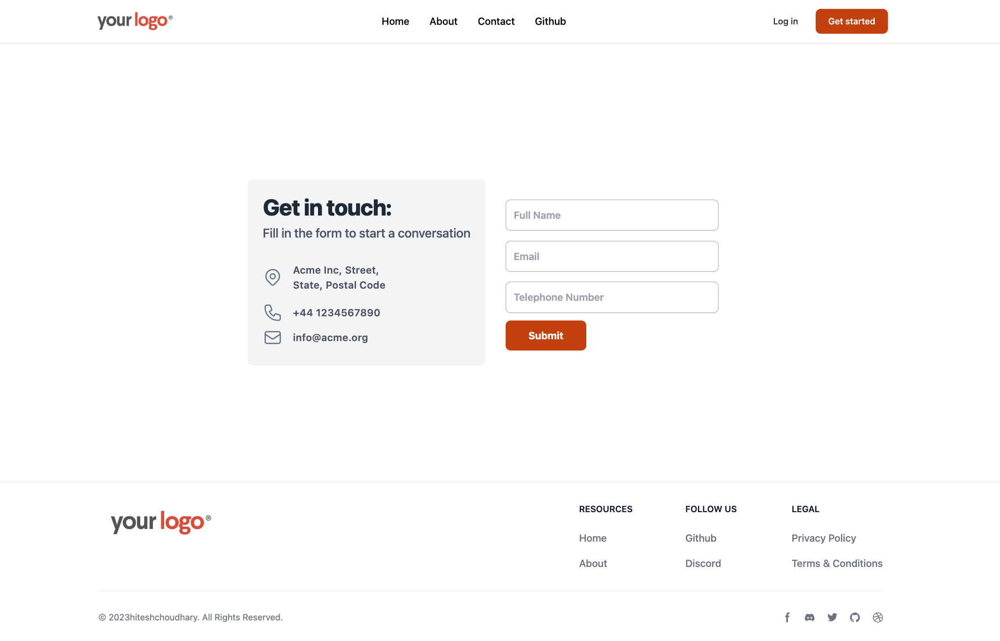
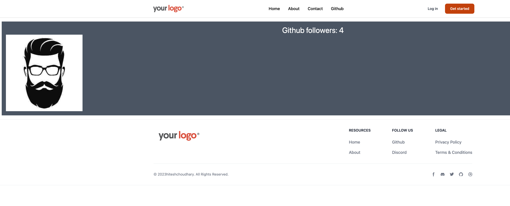

It is not a core part of the React library.

[React router](https://reactrouter.com/en/main)
```sh
npm install react-router-dom
```

you can get the header and footer from https://github.com/hiteshchoudhary/chai-aur-react/blob/main/reactRouterNotes.md

#### Link and NavLink
`Link` -> instead of `a` tag, we use `Link`; `a` tag refreshes the whole page. 
`NavLink` -> provides additional features compared to `Link`

Both `Link` and `NavLink` are components from the `react-router-dom` library used for creating navigation links in React applications. However, they have a key difference in functionality:

- **`Link`:** 
	- This is the basic building block for navigation.
	- It takes a `to` prop that specifies the URL path the link should navigate to. 
	- When clicked, it triggers a programmatic navigation within the React application, preventing a full page reload.
    
- **`NavLink`:** 
	- This is a special kind of `Link` with additional features.
	- It inherits all the functionalities of `Link` but ==adds the concept of an "active" state.== 
	- `NavLink` can determine if the current URL matches the link's `to` prop. ==Based on this comparison, it can apply styles or classes to the rendered element using props like `activeClassName` or `activeStyle`.==
	- This is helpful for visually indicating to users which link corresponds to the current page.

**Choosing between `Link` and `NavLink`:**
- Use `Link` for basic navigation needs where highlighting the active link isn't necessary.
- Use `NavLink` when you want to visually indicate the active link in your navigation component for better user experience.


#### Outlet
We are going to create a layout where Header and Footer will remain the same. The content between Header and Footer will change using `Outlet` of react router.

In React Router DOM, the `Outlet` component is used for managing nested routes and defining where child routes should be rendered within a parent route's layout.

Here's a breakdown of its functionality:

**Purpose:**
- `Outlet` acts as a placeholder within a parent route to specify where content from its child routes should be displayed.
- It allows you to create reusable layouts for your application, with consistent elements like headers, sidebars, or footers, while child routes render their specific content within the designated area.

**How it works:**
1. **Parent Route with Layout:**
    - You define a parent route with its own component that potentially includes elements like navigation or layout structures.
    - Within this parent route component, you'll use the `<Outlet />` component to mark the location where child route content should be injected.
2. **Child Routes:**
    - You define child routes with their own paths and components that represent specific views within the application.

==**Rendering Process:**==
- When a child route is matched based on the URL, its component is rendered and placed within the parent route's `<Outlet />` location.
- This allows you ==to maintain a consistent layout across different sections of your application== while dynamically displaying content based on the current route.

**Additional Features:**
- **Context with `Outlet`:** You can optionally pass context data along with the `<Outlet />` component. This context can be accessed by child routes using the `useOutletContext` hook, enabling data sharing between parent and child routes.

Here are some benefits of using `Outlet`:
- **Improved Code Reusability:** By separating layout and content concerns, you can reuse the parent layout component across various child routes.
- **Organized UI Structure:** It promotes a clear separation between layout and content, making your components more maintainable.
- **Flexibility:** You can define complex nested routes with consistent layouts for a well-structured application.


#### RouterProvider
- In React Router v6, `RouterProvider` is the ==central component for managing routing within your React application==. 
- It ==acts like the traffic controller==, directing users to the appropriate components based on the URL path. 
 
Here's a breakdown of its key aspects:
**Functionality:**
- **Renders the App:** `RouterProvider` is the top-level component that renders your entire React application. It takes care of setting up the routing context and making it available to child components.
- **Provides Routing Context:** It establishes a routing context that encompasses your entire application. This context makes features like navigation hooks (`useNavigate`, `useLocation`) accessible to child components that need to interact with the routing system.
- **Handles Route Matching:** Based on the current URL, `RouterProvider` matches the defined routes and determines which component should be rendered.
- **Data Fetching (Optional):** It works in conjunction with the new Data Router APIs (introduced in v6) to enable data fetching functionalities associated with specific routes.

**How to Use:**
1. **Import RouterProvider:** Import the `RouterProvider` component from `react-router-dom`.
2. **Create Router:** Define your application's routes using the `createBrowserRouter` function from `react-router-dom`. This function allows you to specify paths, components, and other route configurations.
3. **Render with RouterProvider:** Wrap your main application component with `RouterProvider` and pass the created router object as a prop. This establishes the routing context for your app.
    
Here's a basic example:
```
import { BrowserRouter as Router, Routes, Route } from 'react-router-dom';
import HomePage from './pages/HomePage';
import AboutPage from './pages/AboutPage';

const router = createBrowserRouter([
  {
    path: "/",
    element: <HomePage />,
  },
  {
    path: "/about",
    element: <AboutPage />,
  },
]);

function App() {
  return (
    <RouterProvider router={router} />
  );
}

export default App;
```


**Key Points:**
- In contrast to older versions (v5 and below) that used `BrowserRouter`, `RouterProvider` offers more flexibility and decoupling of routing logic.
- It's essential to place `RouterProvider` at a high level in your component hierarchy, typically at the root, to ensure all child components can access the routing context.
- For data fetching functionalities, you'll need to utilize the Data Router APIs alongside `RouterProvider`.

By understanding `RouterProvider`, you can effectively manage navigation and route rendering within your React Router v6 applications.

In our project, we are using it like

`main.jsx`
```js
// defining different routes
const router = createBrowserRouter([
    {
        path: "/",
        element: <Layout />,
        children: [
            // for /
            {
                path: "",
                element: <Home />,
            },
            // for about
            {
                path: "about",
                element: <About />,
            },
            // for about
            {
                path: "contact",
                element: <Contact />,
            }
        ]
    }
]);
```

we can use `createRoutesFromElements()` to create routes

```js
// another way
const router = createBrowserRouter(
    createRoutesFromElements(
        <Route path="/" element={<Layout />}>
            <Route path="" element={<Home />} />
            <Route path="about" element={<About />} />
            <Route path="contact" element={<Contact />} />
        </Route>
    )
);
```

<hr>

we can also pass params through routes.

main.jsx
`<Route path="user/:userId" element={<User />} />`

`components/User/User.jsx`
```js
import { useParams } from "react-router-dom";

function User() {
    const { userId } = useParams();
    return (
        <div>
            User: {userId}
        </div>
    )
}
```

<hr>

fetching information from through API

`main.jsx`
`<Route path="github" element={<Github />} />`

`components/Github/Github.jsx`
```js
function Github() {
    const [data, setData] = useState([])
    useEffect(() => {
        fetch("https://api.github.com/users/raghav-nayak")
            .then(res => res.json())
            .then(data => {
                console.log(data);
                setData(data)
            })
    }, [])

    return (
        <div className="text-center m-4 bg-gray-600 text-white p-4 text-3xl"> 
            Github followers: {data.followers}
            
        </div>
    )
}
```

you can use `loader` to optimize the fetching information. When you hover you cursor on the component and before you click the component, you start fetching the data.
With `loader` you can write enter the fetch. But you can move the code to the relevant component.
check [useLoaderData](https://reactrouter.com/en/main/hooks/use-loader-data)

`components/Github/Github.jsx`
```js
import React, { useEffect, useState } from 'react';
import { useLoaderData } from "react-router-dom";

function Github() {
    const data = useLoaderData();

    return (
        <div className="text-center m-4 bg-gray-600 text-white p-4 text-3xl"> 
            Github followers: {data.followers}
            
        </div>
    )
}

export default Github;

export const githubInfoLoader = async () => {
    const response = await fetch("https://api.github.com/users/raghav-nayak");
    return response.json();
}
```

<hr>






