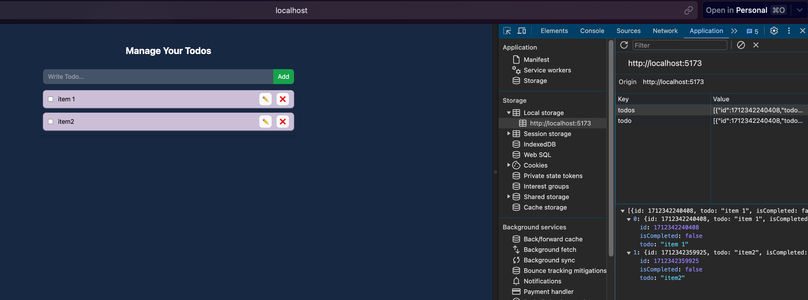

We are going to build todo application with local storage.

we use `localstorage` and it has `getItem()` and `setItem()` methods.
It returns string value so we need to convert it to json.

```js
useEffect(() => {
	localStorage.setItem("todo", JSON.stringify(todos));
}, []);
```


wire up -> linking the input value to context variables.

adding key is very important to div while looping through todo items.


you will find the local storage under Application tab in dev tools.

